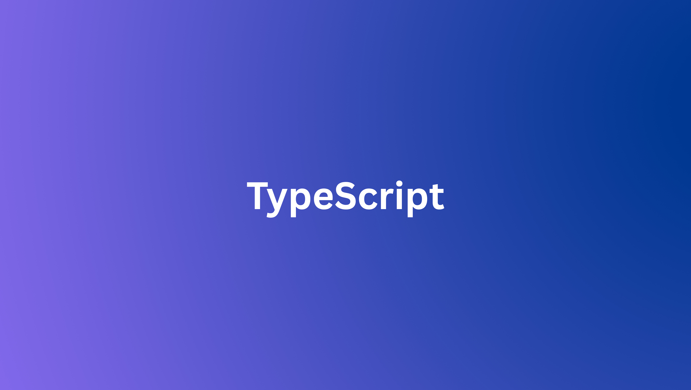

# Beginner Level (Focus: Basic Types, Functions, and Simple Interfaces)

The exercises in this section aim to solidify understanding of fundamental TypeScript features, including primitive types, function typing, and basic object shaping.

## Exercise B1: Basic Type Declarations

> **Goal**: Declare and initialize variables using TypeScript's primitive types.

**Requirements**:

1. Declare a variable `userName` and explicitly assign the type `string`. Initialize it with a name.
2. Declare a variable `userAge` and explicitly assign the type `number`. Initialize it with an age.
3. Declare a variable `isActive` and explicitly assign the type `boolean`. Initialize it.
4. **Self-Check**: Attempt to assign a number to userName to confirm the compiler error.

## Exercise B2: Function Typing and Return Values

> **Goal**: Define a function with strictly typed parameters and an explicit return type.

**Requirements**:

1. Write a function `calculateArea` that accepts two parameters: `width` and `height`.
2. Both parameters must be explicitly typed as `number`.
3. The function must explicitly declare its return type as `number`.
4. The function body should return the product of `width` and `height`.

## Exercise B3: Type Aliases

> **Goal**: Use a `type` alias to create a custom name for a simple type.

**Requirements**:

1. Create a type alias named `ProductID` for the primitive type `string`.
2. Define a function `logProduct` that accepts one parameter `id` of type `ProductID`.
3. The function should print a message including the product ID.

## Exercise B4: Defining a Simple Interface

> **Goal**: Define and implement a simple `interface` for object structure.

**Requirements**:

1. Define an interface InventoryItem with the following properties:

   - `id`: `number`
   - `name`: `string`
   - `inStock`: `boolean`

2. Create a variable `keyboard` and assign an object that conforms exactly to the `InventoryItem` interface.

## Exercise B5: Array and Union Types

> **Goal**: Use array syntax and union types to define an array that holds multiple distinct types.

**Requirements**:

1. Declare an array named `logData`.
2. This array must be able to hold elements that are either a `string` or a `number`.
3. Initialize `logData` with at least three elements: one string, one number, and another string.

# Intermediate Level (Focus: Union/Intersection, Generics, and Classes)

These exercises introduce more robust features, including combining types, handling optionality, and basic object-oriented programming with classes.

## Exercise I1: Optional and Readonly Properties

> **Goal**: Modify an interface to include optional and immutable properties.

**Requirements**:

1. Define an interface `User` with three properties:

   - `id`: `number` (Must be readonly)
   - `username`: `string`
   - `bio`: `string` (Must be optional)

2. Create a user object and attempt to reassign the `id` property after initialization (This should result in a compiler error).

## Exercise I2: Type Narrowing with Union Types

> **Goal**: Write a function that uses runtime checks to narrow down a union type.

**Requirements**:

1. Write a function `processInput` that accepts a parameter `input` of the union type `string` | `number`.
2. Inside the function, use type narrowing (`typeof` check) to:
   - If `input` is a `string`, print the length of the string.
   - If `input` is a `number`, print the value multiplied by 2.

## Exercise I3: Basic Generics in Functions

> **Goal**: Create a reusable function that can operate on data of any single type without losing type information.

**Requirements**:

1. Define a generic function `identity<T>` that accepts one argument of type `T`.
2. The function should return the argument itself.
3. Test the function: call it once with a number (e.g., `identity(42)`) and once with an array of booleans (e.g., `identity([true, false])`). Verify the return type inferred by the compiler is correct in both cases.

## Exercise I4: Modeling with Classes

> **Goal**: Define a class using access modifiers and a constructor.

**Requirements**:

1. Define a class `BankAccount` with the following properties and methods:
   - A private property `balance` initialized to 0.
   - A public property `accountHolderName` set via the constructor.
   - A public method `deposit(amount: number)` that adds to the balance.
   - A public method `getBalance()` that returns the current `balance`.

## Exercise I5: Intersecting Types

> **Goal**: Combine two separate interfaces into a single type using an intersection.

**Requirements**:

1. Define an interface `Logger` with a method `log(message: string): void`.
2. Define an interface `Authenticator` with a method `authenticate(key: string): boolean`.
3. Create a type alias `Service` that is the intersection of `Logger` and `Authenticator` `(Logger & Authenticator)`.
4. Define an object `apiService` of type `Service` and implement both methods.

# Pro Level (Focus: Advanced Generics, Utility Types, and Complex Type Patterns)

These exercises explore powerful features of the TypeScript type system, requiring a deeper understanding of type manipulation and pattern matching.

## Exercise P1: Discriminated Unions for Type Safety

> **Goal**: Create a union type that can be safely narrowed using a common, literal property (the discriminator).

**Requirements**:

1. Define an `interface` ActionLoad with properties: `type: "LOAD"` and `data: string[]`.
2. Define an `interface` ActionError with properties: `type: "ERROR"` and `message: string`.
3. Create a type alias `AppAction` which is the union of `ActionLoad | ActionError`.
4. Write a function `handleAction(action: AppAction)` that uses a `switch` statement on the `action.type` property to correctly access either action.data (for LOAD) or `action.message` (for `ERROR`).

## Exercise P2: Generic Constraints with `keyof`

> **Goal**: Create a function that safely accesses a property of an object using generics and constraints.

**Requirements**:

1. Write a generic function `getProperty<T, K extends keyof T>` that accepts two arguments:
   - `obj`: An object of type `T`.
   - `key`: A property name of type `K` (must be a key of `T`).
2. The function should return the value of the specified property (`T[K]`).
3. Test the function with a predefined object (e.g., `{ a: 1, b: 'hello' }`) to ensure only valid keys can be passed.

## Exercise P3: Utilizing Standard Utility Types

> **Goal**: Apply the `Partial<T>` and `Required<T>` utility types for common data transformation scenarios.

**Requirements**:

1. Define an interface Settings with all properties being optional:
   - `timeout?`: `number`
   - `verbose?`: `boolean`
2. Create a new type `FullSettings` using the `Required<T>` **utility type** based on `Settings`. Create an object of type `FullSettings` and verify all properties must be present.
3. Define an interface `APIResponse` with required properties: `status: number`, `data: object`, and `message: string`.
4. Create a new type `OptionalResponse` using the `Partial<T>` **utility type** based on `APIResponse`.

## Exercise P4: Advanced Mapped Types

> **Goal**: Create a mapped type that transforms properties of an existing interface into function types.

**Requirements**:

1. Define an interface Configuration with properties:
   - `logging`: `boolean`
   - `port`: `number`
   - `host`: `string`
2. Use a **mapped type** to create a new type Setters where:
   - The property names are prefixed with `set` (e.g., `setLogging`).
   - The property values are functions that take the original property's value type as an argument and return `void`.

## Exercise P5: Conditional Types and Type Filtering

> **Goal**: Write a conditional type to filter properties based on their value type.

**Requirements**:

1. Define an interface `UserProfile` with a mix of types: `id: number`, `name: string`, `isAdmin: boolean`, `preferences: object`.
2. Write a **conditional type** `FilterKeys<T, Type>` that takes an object type `T` and a target value type `Type` (e.g., `string`).
3. The resulting type should be a union of all **key names** in `T` whose corresponding value is assignable to `Type`.
4. Test: Create a type alias `StringKeys` using `FilterKeys<UserProfile, string>`. The resulting type should only be `'name'`.
